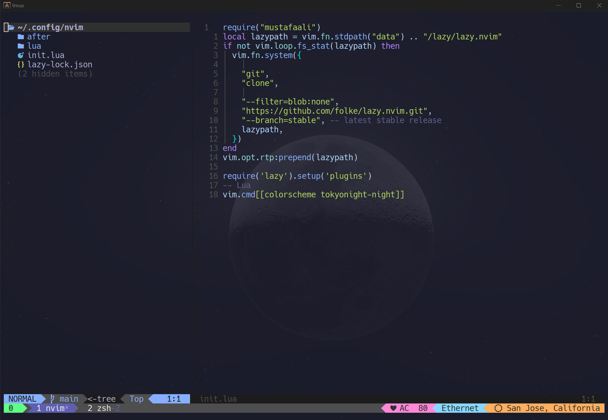

# nvim
my nvim config 

I use Lazy.nvim as my plugin manager, and try to always optimize my startup time. 
only have needed plugins
{
  "Comment.nvim"
  
  "LuaSnip"
  
  "barbar.nvim"
  
  "cmp-nvim-lsp"
  
  "harpoon"
  
  "indent-blankline.nvim"
  
  "lazy.nvim"
  
  "leap.nvim"
  
  "lsp-zero.nvim"
  
  "lualine.nvim"
  
  "mason-lspconfig.nvim"
  
  "mason.nvim"
  
  "neo-tree.nvim"
  
  "noice.nvim"
  
  "nui.nvim"
  
  "nvim-autopairs"
  
  "nvim-cmp"
  
  "nvim-lspconfig"
  
  "nvim-notify"
  
  "nvim-surround"
  
  "nvim-tmux-navigation"
  
  "nvim-treesitter"
  
  "nvim-web-devicons"
  
  "playground"
  
  "plenary.nvim"
  
  "telescope.nvim"
  
  "toggleterm.nvim"
  
  "tokyonight.nvim"
  
  "transparent.nvim"
  
  "undotree"
  
  "vim-be-good"
  
  "vim-fugitive"
  
}
